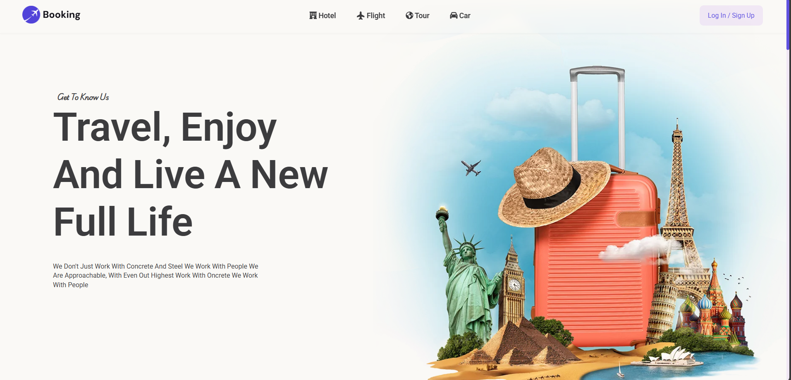

# 🏨 Booking Website
**UNFINISHED YET**
A fully responsive and interactive **Booking Website** built using **HTML**, **CSS**, and **JavaScript**. Perfect for hotels, travel, events, or service-based platforms where users can check availability and make reservations.

## 🛠️ Tech Stack

- **HTML5** – Semantic and accessible markup  
- **CSS3** – Modern styling with flexbox/grid  
- **JavaScript (ES6)** – Interactivity, date validation, and form handling  

## ✨ Features

✅ **Responsive Layout** – Works perfectly on mobile, tablet, and desktop  
✅ **Interactive Booking Form** – Includes check-in/check-out, guests, and room type  
✅ **Form Validation** – Checks for valid dates and required inputs  
✅ **Date Picker** – Custom or built-in browser picker for smooth UX  
✅ **Confirmation Message** – Displays a custom success alert upon booking  
✅ **Modern UI** – Clean design with subtle animations  
✅ **Smooth Scroll & Navigation** – Better user experience  

## 📸 Preview

## 🚀 Live Demo

[🔗 View Live](https://ahmedragab15.github.io/Booking-Website/)
